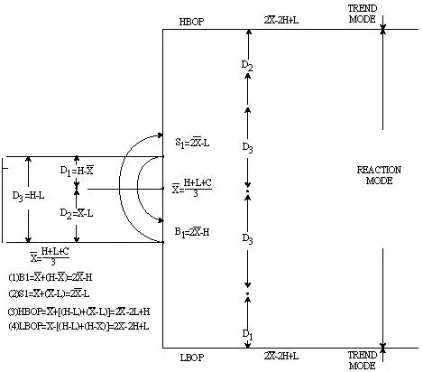
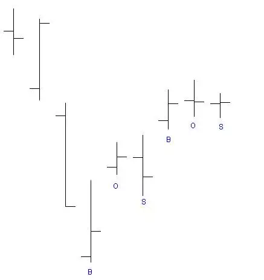
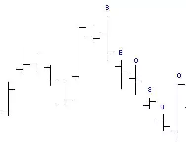
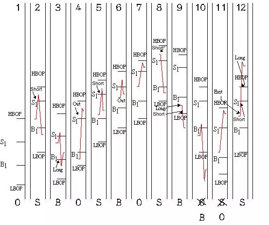

# 反应趋势交易系统 (RTS)
---
## 简介

RTS 为反应趋势现况系统 (Reaction Trend System)。 本系统为 Wells Wilder (DMI 指标创始人) 所创立，主要借用 **波动幅度** 来判断多空力量，进而计算系统交易时采取顺势策略 (Trend Mode) 或逆势 (Reaction Mode) 的参考依据。

## 原理

1. 利用 `(H+L+C)/3` 当作一天多空决战的终结点，并利用此点来定义出多空力量，再根据此力量来推算逆势策略或顺势策略的判断及买卖依据。
2. 作者依据自己主观观察，发现价格移动常有 “3天上涨2天下跌” 的模式，因此设计出哪天该执行买进策略，哪天执行出场策略，哪天应执行逐势交易等决策参考交易系统。

## 参考点计算方法

1. 重要概念
    ```
    # 一天多空决战后的最后平衡点
    X = (H+L+C)/3
    # 高点至平衡点的距离，代表空头的力量、意愿或战果
    D1 = H-X
    # 平衡点至低点的距离，代表多头的力量、意愿或战果
    D2 = X-L
    # 高低点距离，代表多空双方该日的战场
    D3 = H-L
    # 以平衡点为起点，往下推一个该日空头的力量 (D1)，则假设卖方意愿将会衰竭，视为买方进场的参考点
    B1 = X-D1 = 2X-H
    # 以平衡点为起点，往上推一个该日多头的力量 (D2)，则假设买方意愿将会衰竭，视为卖方进场的参考点
    S1 = X+D2 = 2X-L
    # 以平衡点为起点，往上推一个该日战场规模 (D3)，再加上一个该日多头力量 (D2)，若能超过该点，表示多头意愿极高，应采取逐势做多交易模式
    HBOP = X+(D3+D2) = 2X-2L+H (High Break Out Point)
    # 以平衡点为起点，往下推一个该日战场规模 (D3)，再加上一个该日空头力量 (D1)，若能超过该点，表示空头意愿极高，应采取逐势做空交易模式
    LBOP = X-(D3+D1) = 2X-2H+L
    ```

2. 图例

    

## 交易日的标示方法

本系统特殊的地方在于交易日的标示，依据不同交易日标示而采用不同的量化策略

1. 上涨走势  
  取最近一至两周内的最低点标示为 *B*，第二根标示为 *O*，第三根标示为 *S*，然后又回到 *B*，*O*，*S*，*B*，*O*，*S*，……直至最后一根。如下图：
  

2. 下跌走势
  取最近一至二周内的最高点标示为 *S*，第二根标示为 *B*，第三根标示为 *O*，然后又回到 *S*，*B*，*O*，*S*，*B*，*O*，……直至最后一根。如下图：
  

3. 调整
  若价格涨破 *HBOP* 或跌破 *LBOP* 时应重新修正标示内容，修正原则如下：
  > 1. 突破 *HBOP* 后属于做多的逐势交易，于做多逐势交易期间的高点位置重新标示 *S*，随后依 *B*，*O*，*S*，……顺序重新标示
  > 2. 跌破 *LBOP* 后属于做空的逐势交易，于做空趋势交易期间的低点位置重新标示 *B*，随后依 *O*，*S*，*B*，……顺序重新标示

## 本交易系统使用方法

### 逆势交易模式
1. 进场
  - 在 *B* 日于 *B1* 点买进，停损设于 *LBOP*
  - 在 *S* 日于 *S1* 点卖出，停损设于 *HBOP*
2. 出场后不反向进场
  - 有做多未平仓部位时：
    - 在 *O* 日于 *S1* 点平仓
    - 如果在 *S* 日没有碰触 *S1* 点时于收盘价出场
    - 于 *B* 日进场后除非跌破 *LBOP*，否则碰触任何点都不出场。若跌破 *LBOP* 则应出场并反向进行放空逐势交易
  - 有做空未平仓部分时：
    - 如果在 *B* 日没有碰触 *B1* 时于收盘价出场
    - 于 *S* 日进场后除非涨破 *HBOP*，否则碰触任何点都不出场。若涨破 *HBOP* 则应出场并反向进行做多逐势交易
3. 出场并反向进场：
  - 有做多未平仓部分时：
    - 在 *S* 日碰触 *S1* 点时
    - 任何一天碰触 *LBOP* 时
  - 有做空未平仓部分时：
    - 在 *B* 日碰触 *B1* 点时
    - 任何一天碰触 *HBOP* 时

### 逐势交易模式
1. 进场
  - 在任何一天涨破 *HBOP* 时买进
  - 在任何一天跌破 *LBOP* 时卖出
2. 出场
  - 在多仓时以最近两日的低价当出场参考，逐日依两日原则向上移动停损直至出场，出场后不反向进场
  - 有空仓时以最近两日的高价当出场参考，逐日依两日原则向下移动停损直至出场，出场后不反向进场

    

## 结论

1. 本量化交易系统利用波幅观察多空力量，并借以计算出进出场参考点，每日计算出的数值均于下一交易日参考使用
2. 任何市场的价格都是随机波动的，至目前为止，没有任何工具可以百分百计算市场的支撑压力区，因此系统交易在使用时应注意严守交易停损纪律
